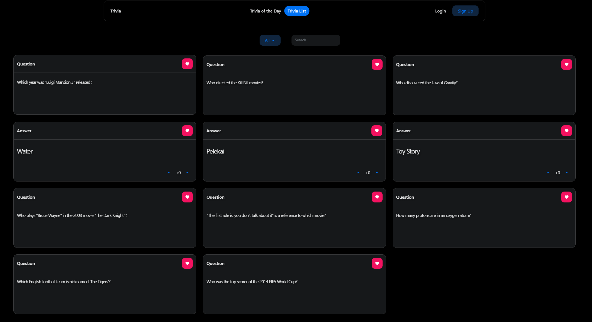

# Trivia Site

# Table of contents
1. [Description](#description)
2. [Screenshots](#screenshots)
3. [Architecture Overview](#architecture-overview)
4. [API Documentation](#api-documentation)
5. [Installation and Usage](#installation-usage)

## Description 
A WIP full-stack Trivia-searching web application built with React on the frontend and Django/Django-Rest-Framework on the backend.

<ins>Planned/Completed Features</ins>:
- Responsive layout
- Session based authentication stored in HTTPOnly Cookie
- Users:
  - Users can:
    - Signup/Login/Logout
    - Update their password (WIP)
    - Delete their account (WIP)
  - Currently loggedin user info is displayed on the home page (WIP)
  
- Trivia:
  - Users can:
    - Each Trivia is a flippable card with questions on the front, answers on the back
    - View all Trivia at once or filter Trivia by Categories
    - Create a Trivia (WIP)
    - Vote on a Trivia (WIP)
    - Edit a Triva (WIP)
    - Delete a Trivia (WIP)
    - Favourite a Trivia and View all favourited Trivia (WIP)

## Screenshots 

## API Documentation 
- <ins>Users</ins>:
  - `accounts/signup/` -> POST
  - `accounts/login/` -> POST
  - `accounts/logout/` -> POST

- <ins>Trivia</ins>:
  - `trivia/question/` -> GET, POST, PUT, DELETE
    - Query Parameters (GET)
      - Search?={string}
      - Trivia_category?={int}
  - `trivia/question/{questionId}/` -> GET
  - `trivia/category/` -> GET, POST, PUT, DELETE
  - `trivia/category/{categoryId}/` -> GET
    

## Installation and Usage 
#### <ins>**General**</ins>
- Requirements:
  - `node >= 16.14.0`
  - `npm >= 8.3.1`
  - `python >= 3.8`
  - `pip >= 21.3.1`
- `git clone https://github.com/postalpotato/TriviaSite` - clones the repository
> NOTE: First run backend server (it will run on `http://127.0.0.1:8000`), then run frontend app (it will run on `http://127.0.0.1:3000`)

#### <ins>**For frontend folder**</ins> 
- `cd frontend`
- `npm install` or `npm i` - installs all packages
- `npm install --save-dev` - installs devDependencies 
- `npm start` - starts the app

#### <ins>**For backend folder**</ins>
- `cd backend`
- `py -m venv yourVenvName` - creates a virtual environment
- `yourVenvName\Scripts\activate.bat` - activates the virtual environment
- `pip install -r requirements.txt` - installs all modules
- [Set up postgresql db (or db of choice)](https://docs.djangoproject.com/en/4.1/ref/databases/#postgresql-notes)
- `python manage.py makemigrations` & `python manage.py migrate` - migrates all the tables to db
- `python manage.py createsuperuser` - creates a superuser
- `python manage.py runserver` - runs the server

